# Kế hoạch Bổ sung v2.3 — Đặc tả 3.0.0

> **Changelog:**
> - **v1:** Bản phân tích đầu tiên từ 2.8.0, chỉ ra 7 gap chính.
> - **v2:** Tách Users/UserProfiles, Redis cho brute-force & OTP, pgvector cho Nutritions, sửa flow đăng ký (email verification), bổ sung 15 Sequence Diagrams bằng Mermaid.
> - **v2.1:** Tách Use Case Diagram thành 2 file, cập nhật mask_polygon thay bounding_box.
> - **v2.2:** Thêm bảng ký hiệu UML chuẩn, checklist tính năng, section Giải thích thuật ngữ.
> - **v2.3:** Đối chiếu feedback cô (v2.7.0), phát hiện 9 vi phạm trong 3.0.0.tex, bổ sung cách sửa triệt để.

---

# PHẦN 0: ĐỐI CHIẾU FEEDBACK CỦA CÔ (v2.7.0) VỚI FILE 3.0.0.tex

> [!CAUTION]
> File `3.0.0.tex` hiện tại (copy từ 2.8.0) vẫn **CÒN VI PHẠM** các feedback dưới đây. Cần sửa triệt để.

## VP-1: Sai cách định nghĩa Người dùng

**Feedback cô:** "Sai người dùng — quản trị cũng đang sử dụng hệ thống. Nêu rõ mục đích, định nghĩa ra."

**Hiện trạng 3.0.0:** Dùng `BỘ PHẬN: NÔNG DÂN` và `BỘ PHẬN: QUẢN TRỊ VIÊN` — chỉ nêu tên, chưa định nghĩa rõ mục đích sử dụng.

**Cách sửa:** Đổi cách trình bày, định nghĩa actor bằng MỤC ĐÍCH:

| Hiện tại (SAI) | Sửa thành (ĐÚNG) |
|----------------|-------------------|
| `BỘ PHẬN: NÔNG DÂN` | **Người dùng — Nông dân (ND):** Người sử dụng hệ thống với mục đích chẩn đoán bệnh trên cây lúa qua hình ảnh, xem gợi ý dinh dưỡng và phản hồi kết quả chẩn đoán. |
| `BỘ PHẬN: QUẢN TRỊ VIÊN` | **Người dùng — Quản trị viên (AD):** Người sử dụng hệ thống với mục đích quản lý danh mục bệnh, kho tri thức dinh dưỡng, tài khoản người dùng và theo dõi hiệu suất mô hình. |

---

## VP-2: 1 chức năng = 1 quy định → SAI

**Feedback cô:** "Nếu có 100 chức năng thì 100 quy định? Người đọc không thể nắm được hết."

**Hiện trạng 3.0.0:** Có 12 chức năng ND → 12 quy định riêng (ND_QĐ 1–12). Có 10 chức năng AD → 7 quy định (AD_QĐ 1–7). Tỷ lệ gần 1:1.

**Cách sửa:** Gom quy định theo **nhóm nghiệp vụ**, không theo từng chức năng:

| Hiện tại (12 QĐ riêng lẻ) | Gom thành (5 QĐ nhóm) |
|---------------------------|----------------------|
| ND_QĐ 1 (Đăng ký) + ND_QĐ 2 (Đăng nhập) + ND_QĐ 3 (Khôi phục MK) | **QĐ-ND-01: Quy định Quản lý tài khoản** — gom tất cả quy tắc về tài khoản |
| ND_QĐ 4 (Xem) + ND_QĐ 5 (Sửa) | **QĐ-ND-02: Quy định Hồ sơ cá nhân** |
| ND_QĐ 6 (Gửi ảnh) + ND_QĐ 7 (Thông số MT) + ND_QĐ 8 (Xem KQ) | **QĐ-ND-03: Quy định Chẩn đoán bệnh** |
| ND_QĐ 9 (Lịch sử) + ND_QĐ 10 (Chi tiết) | **QĐ-ND-04: Quy định Tra cứu lịch sử** |
| ND_QĐ 11 (Gửi PH) + ND_QĐ 12 (Xem KQ PH) | **QĐ-ND-05: Quy định Phản hồi kết quả** |

Tương tự cho Admin: gom từ 7 QĐ → 4–5 QĐ nhóm.

---

## VP-3: Quy định đang mô tả FIELD, chứ không phải QUY TRÌNH

**Feedback cô:** "Đăng ký TK có 3 thông tin? Ở dưới là 3 field → TK phải có 3 field. Đang quy định cho từng field chứ không phải đăng ký."

**Hiện trạng 3.0.0 (ND_QĐ 1):**
```
Hệ thống chỉ cho phép tạo tài khoản khi người dùng nhập đầy đủ:
- Tên đăng nhập: chưa tồn tại...
- Email: đúng định dạng...
- Mật khẩu: tối thiểu 8 ký tự...
```
→ Đây là mô tả từng field, KHÔNG phải quy định quy trình đăng ký.

**Cách sửa — viết lại theo cấu trúc 3 phần:**

> **1. Định nghĩa:** Tài khoản bao gồm 4 thông tin: tên đăng nhập, địa chỉ email, mật khẩu, xác nhận mật khẩu.
>
> **2. Quy trình đăng ký:**
> - Bước 1: Người dùng nhập đầy đủ 4 thông tin trên.
> - Bước 2: Hệ thống kiểm tra tính hợp lệ (tên chưa tồn tại, email chưa đăng ký, MK đủ mạnh, xác nhận MK khớp).
> - Bước 3: Hệ thống tạo tài khoản ở trạng thái chưa kích hoạt.
> - Bước 4: Hệ thống gửi email xác thực — người dùng nhấn link để kích hoạt.
>
> **3. Ràng buộc từng thông tin:** *(bảng riêng nếu cần)*

---

## VP-4: Mô tả kiểm tra mật khẩu khi đăng nhập — SAI

**Feedback cô:** "Kiểm tra mật khẩu: sai. MK có đúng với tên đăng nhập và email không?"

**Hiện trạng 3.0.0 (ND_QĐ 2):**
```
- Tên đăng nhập hoặc email: phải tồn tại trong hệ thống.
- Mật khẩu: phải khớp với tài khoản tương ứng.
```
→ Mô tả tách rời: check field 1 xong, check field 2. SAI logic — phải check **cặp** (tên đăng nhập/email + mật khẩu) cùng lúc.

**Cách sửa:**

> **Quy trình đăng nhập:**
> - Bước 1: Người dùng nhập 2 thông tin: tên đăng nhập (hoặc email) và mật khẩu.
> - Bước 2: Hệ thống kiểm tra mật khẩu có đúng với tên đăng nhập hoặc email đã nhập hay không.
> - Bước 3: Nếu sai → thông báo chung "Tên đăng nhập hoặc mật khẩu không chính xác". Sai 5 lần → khóa 15 phút.
> - Bước 4: Nếu đúng + tài khoản đã kích hoạt → đăng nhập thành công.

---

---

## VP-5: Admin đăng nhập — cùng lỗi VP-4

**Hiện trạng 3.0.0 (AD_QĐ 1, dòng 411–416):**
```
Quản trị viên cần nhập 2 thông tin để đăng nhập:
- Tên đăng nhập: phải tồn tại trong hệ thống.
- Mật khẩu: phải khớp với tài khoản quản trị.
```
→ Giống hệt VP-4: mô tả tách rời từng field, check MK không gắn với username.

**Cách sửa:** Áp dụng giống VP-4 — viết quy trình đăng nhập theo bước, check **cặp** (tên đăng nhập + mật khẩu).

---

## VP-6: QĐ phần Admin cũng mô tả FIELD, không phải QUY TRÌNH

**Hiện trạng 3.0.0:** AD_QĐ 2 (Quản lý bệnh) liệt kê "Tên bệnh, Tên khoa học, Mô tả triệu chứng" rồi mới nói quy tắc xử lý. AD_QĐ 3 (Tri thức DD) tương tự. Đây là mô tả **cấu trúc bản ghi** chứ không phải **quy trình quản lý**.

**Cách sửa:** Áp dụng cấu trúc 3 phần giống VP-3:
> **1. Định nghĩa:** Bản ghi bệnh gồm: tên bệnh, tên KH, mô tả triệu chứng.
> **2. Quy trình quản lý:** Bước 1 thêm → Bước 2 sửa → Bước 3 xóa/ẩn.
> **3. Ràng buộc:** Tên bệnh duy nhất, xóa vĩnh viễn chỉ khi chưa có lịch sử.

---

## VP-7: "Tách ra quản lý bệnh" — feedback cô chưa xử lý đúng

**Feedback cô:** "Tách ra quản lý bệnh"

**Hiện trạng 3.0.0:** Phần Quản trị viên có nhóm "Quản lý danh mục" gộp chung:
- Quản lý bệnh lúa (AD_QĐ 2)
- Quản lý tri thức dinh dưỡng (AD_QĐ 3)

**Vấn đề:** Cô yêu cầu "Quản lý bệnh" phải là **nhóm riêng biệt**, không gộp chung với "Tri thức dinh dưỡng" dưới tên "Quản lý danh mục".

**Cách sửa:** Tách bảng chức năng Admin thành 6 nhóm thay vì 5:

| Hiện tại | Sửa thành |
|----------|----------|
| II. Quản lý danh mục (gộp bệnh + DD) | **II. Quản lý bệnh lúa** (riêng) |
| | **III. Quản lý tri thức dinh dưỡng** (riêng) |

→ Cập nhật cả Use Case Diagram Admin: tách subgraph "Quản lý danh mục" → 2 subgraph riêng.

---

## VP-8: Flow đăng ký trong tex chưa có Email Verification

**Hiện trạng 3.0.0 (ND_QĐ 1, dòng 188):**
```
Quy tắc xử lý: Tạo tài khoản thành công thì tự động chuyển vào màn hình chính.
```
→ Thiếu hoàn toàn bước **gửi email xác thực** → **kích hoạt tài khoản**. Plan đã có SD-01 với email verification, nhưng nội dung QĐ trong tex chưa phản ánh điều này.

**Cách sửa:** Bổ sung bước 3-4 trong quy trình đăng ký:
> - Bước 3: Hệ thống tạo tài khoản ở trạng thái **chưa kích hoạt** và gửi email xác thực.
> - Bước 4: Người dùng nhấn link trong email để **kích hoạt tài khoản**.
> - Bước 5: Sau khi kích hoạt, người dùng có thể đăng nhập.

---

## VP-9: Sequence Diagrams cần đồng bộ với cấu trúc QĐ mới

**Vấn đề:** Sau khi gom QĐ theo nhóm (VP-2), tên tham chiếu trong bảng chức năng sẽ thay đổi:
- Cũ: `ND_QĐ 1`, `ND_QĐ 2`, ... (12 mã riêng lẻ)
- Mới: `QĐ-ND-01` (gom TK), `QĐ-ND-02` (gom Hồ sơ), ... (5 mã nhóm)

**Cách sửa:**
- Cập nhật cột "Quy định/CT liên quan" trong bảng chức năng → tham chiếu mã mới.
- Trong chi tiết QĐ, dùng tiêu đề phụ (subsection) cho từng quy trình trong nhóm.
- Ví dụ: `QĐ-ND-01 — Quản lý tài khoản` chứa 3 phần: **a) Đăng ký**, **b) Đăng nhập**, **c) Khôi phục MK**.
- Sequence Diagrams giữ nguyên SD-01, SD-02, SD-03 nhưng ghi chú tham chiếu đến phần a, b, c của QĐ-ND-01.

---

## Tóm tắt TOÀN BỘ vi phạm cần sửa trong 3.0.0.tex

| # | Vi phạm | Mức độ | Ảnh hưởng |
|---|---------|--------|-----------|
| VP-1 | Sai cách định nghĩa người dùng (chưa nêu mục đích) | 🔴 | Tiêu đề 2 section chính |
| VP-2 | 1 chức năng = 1 quy định (quá nhiều, không gom nhóm) | 🔴 | Toàn bộ bảng QĐ (ND 12→5, AD 7→5) + chi tiết |
| VP-3 | Quy định ND mô tả field thay vì quy trình | 🔴 | ND_QĐ 1, 2, 3 (đăng ký, đăng nhập, khôi phục) |
| VP-4 | Kiểm tra MK Nông dân mô tả sai (tách rời) | 🟡 | ND_QĐ 2 |
| VP-5 | Kiểm tra MK Admin — cùng lỗi VP-4 | 🟡 | AD_QĐ 1 |
| VP-6 | Quy định Admin cũng mô tả field không quy trình | 🔴 | AD_QĐ 2, AD_QĐ 3 |
| VP-7 | Chưa tách riêng "Quản lý bệnh" khỏi "Quản lý danh mục" | 🟡 | Bảng CN Admin + Use Case Diagram |
| VP-8 | Flow đăng ký thiếu email verification | 🔴 | ND_QĐ 1 + SD-01 |
| VP-9 | Mã QĐ cần đồng bộ sau khi gom nhóm | 🟡 | Toàn bộ tham chiếu QĐ |

---

# PHẦN 1: GÓC NHÌN NGHIỆP VỤ

## 1.1 Tầm nhìn dự án

> [!WARNING]
> Tài liệu hiện tại thiếu phần Tầm nhìn. Cần bổ sung ngay trước "Phạm vi áp dụng đề tài".

| Mục | Nội dung |
|-----|---------|
| **Nỗi đau** | Chẩn đoán bằng mắt → sai, chậm, lạm dụng thuốc |
| **Giải pháp** | AI (CNN) nhận diện qua ảnh + GPS thời tiết + gợi ý dinh dưỡng |
| **Giá trị** | Chẩn đoán 5-7s, chính xác, giảm thuốc hóa học |
| **Out-of-Scope** | IoT sensor, thương mại điện tử, tích hợp ERP |

## 1.2 Quy trình As-Is / To-Be

> [!WARNING]
> Thiếu hoàn toàn. Cần bổ sung section mô tả quy trình trước và sau khi có hệ thống.

- **As-Is:** Phát hiện triệu chứng → tự đoán → hỏi người xung quanh (1-3 ngày) → mua thuốc cảm tính
- **To-Be:** Chụp ảnh → AI nhận diện (5-7s) → gợi ý dinh dưỡng → phản hồi → tái huấn luyện

## 1.3 Use Case Diagram

> Tách thành 2 biểu đồ riêng biệt để dễ đọc. Xuất ảnh rồi chèn vào LaTeX bằng `\includegraphics`.

**Quy ước ký hiệu UML chuẩn khi xuất ảnh:**

| Ký hiệu | Ý nghĩa |
|---------|--------|
| Hình người (stick figure) | Actor — tác nhân tương tác với hệ thống |
| Hình elip | Use Case — chức năng hệ thống |
| Hình chữ nhật bao quanh | System Boundary — ranh giới hệ thống |
| Đường liền | Association — actor sử dụng use case |
| Mũi tên đứt nét + `<<include>>` | Use case bắt buộc gọi đến use case khác |
| Mũi tên đứt nét + `<<extend>>` | Use case mở rộng (tùy chọn, không bắt buộc) |

### Use Case — Nông dân

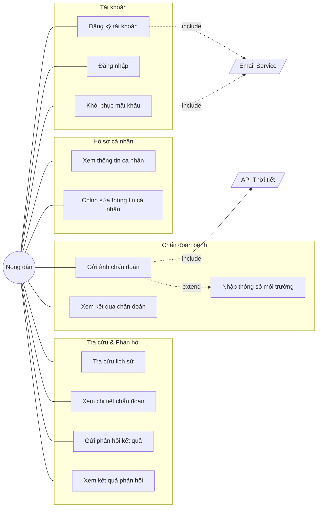

### Use Case — Quản trị viên

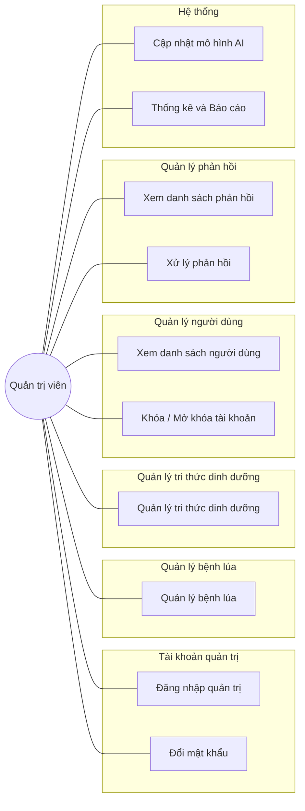

---

# PHẦN 2: GÓC NHÌN KỸ THUẬT

## 2.1 Sequence Diagrams

### SD-01: Đăng ký tài khoản (có Email Verification)

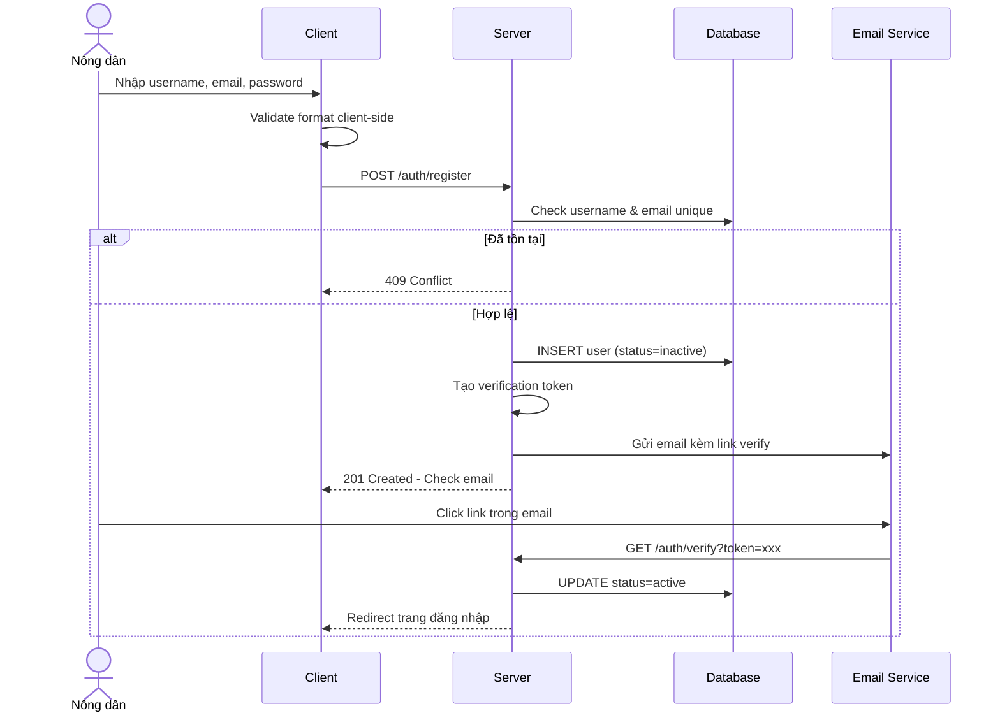

### SD-02: Đăng nhập

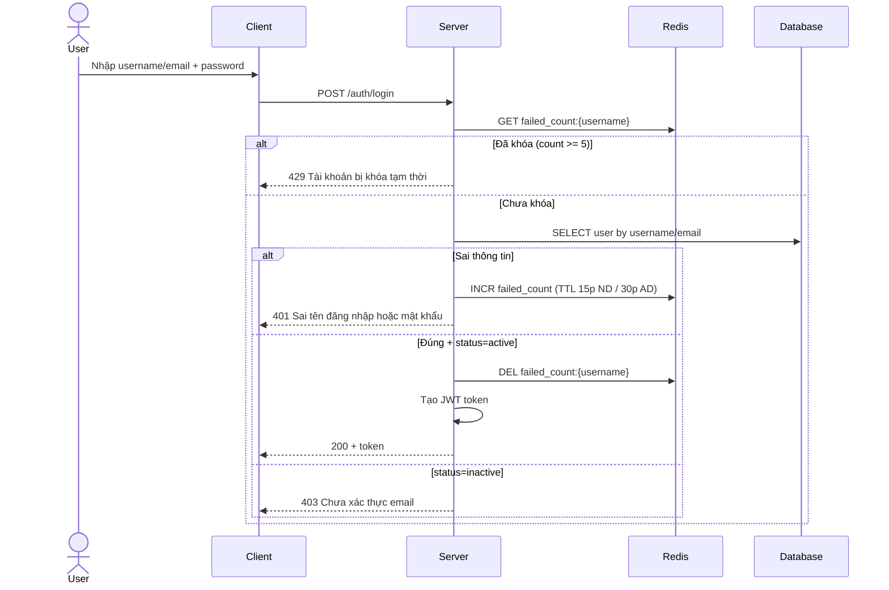

### SD-03: Khôi phục mật khẩu

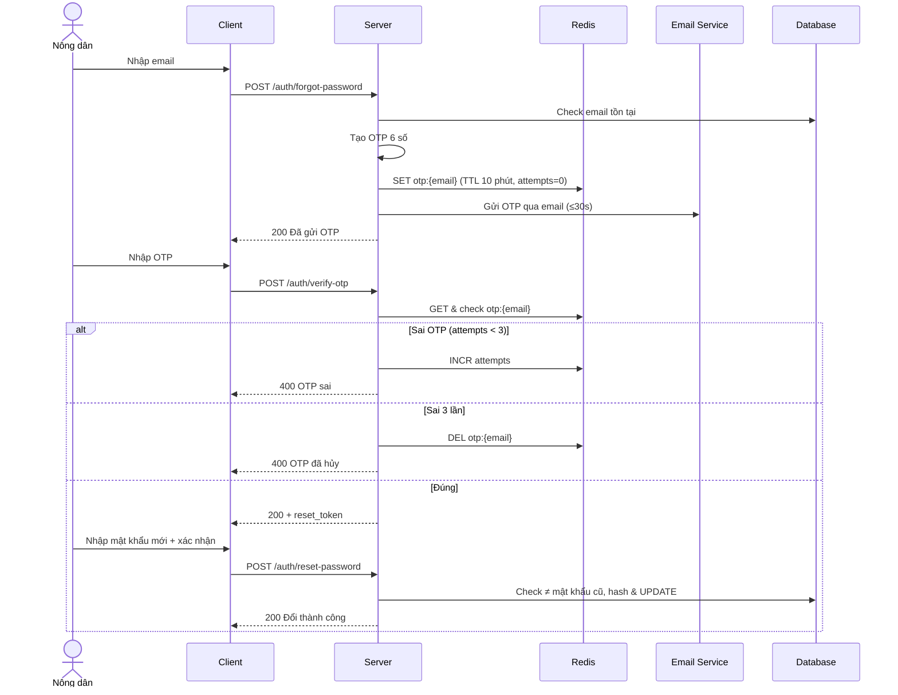

### SD-04: Xem & Chỉnh sửa hồ sơ

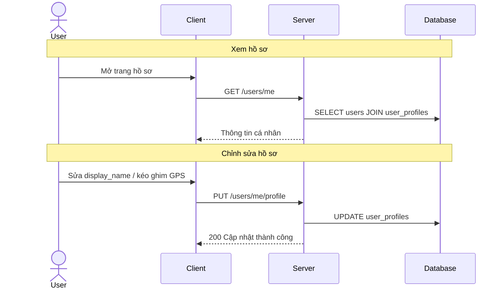

### SD-05: Gửi ảnh chẩn đoán (Core Flow)

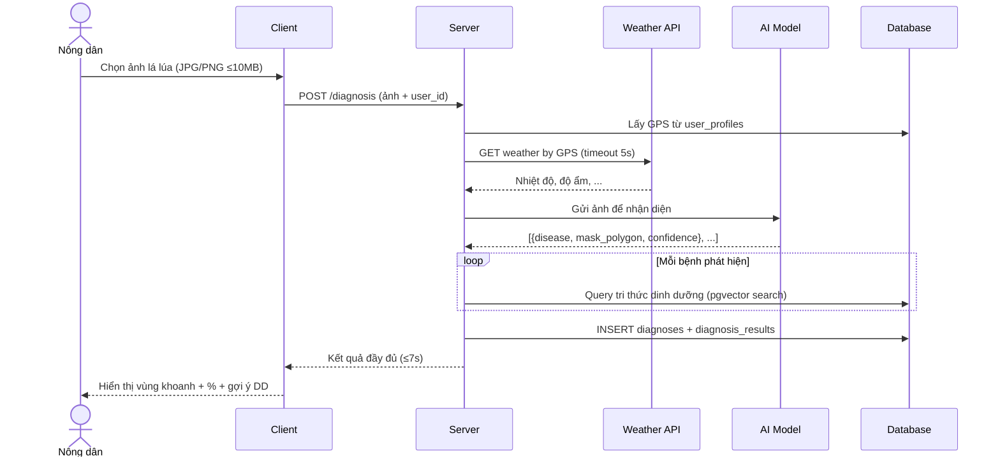

### SD-06: Nhập thông số môi trường (extends SD-05)

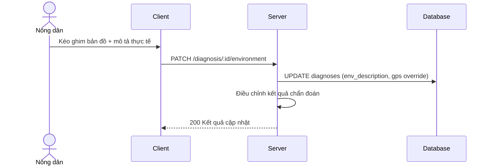

### SD-07: Tra cứu lịch sử & Xem chi tiết

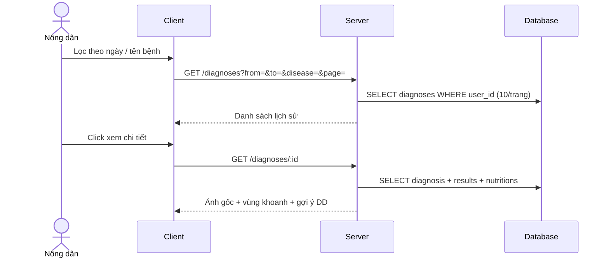

### SD-08: Gửi phản hồi

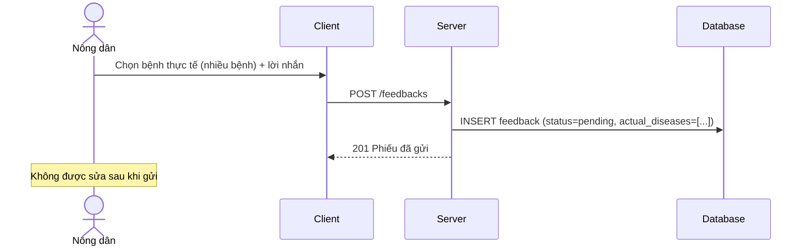

### SD-09: Xem kết quả phản hồi

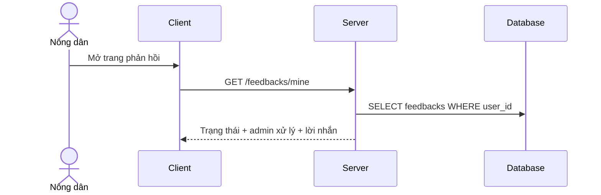

### SD-10: Quản lý bệnh lúa (CRUD)

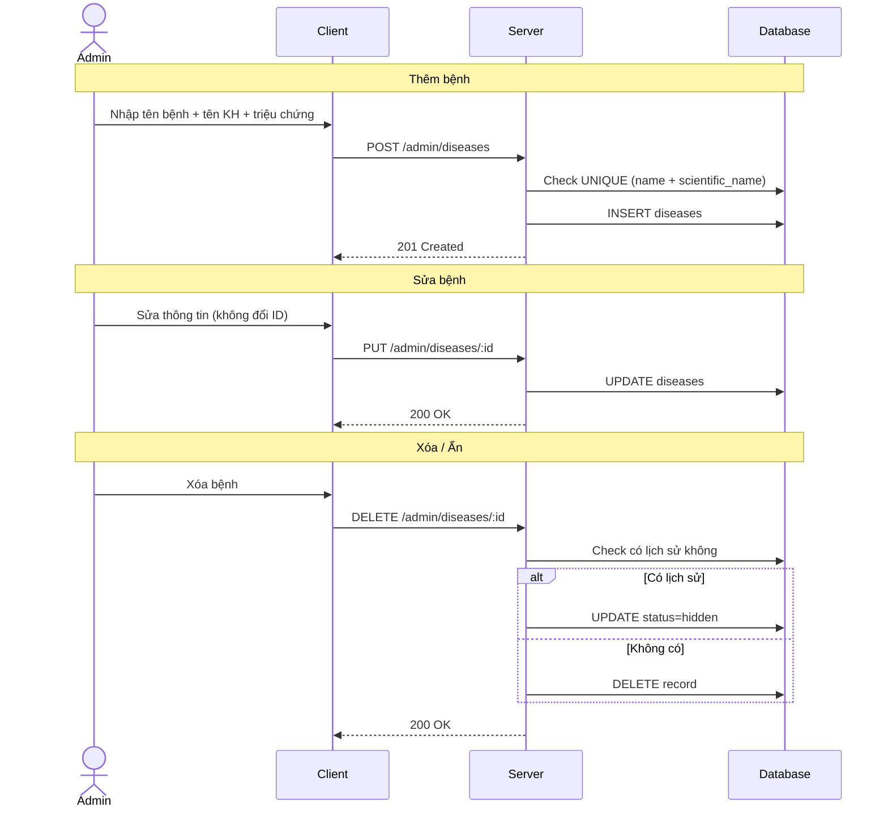

### SD-11: Quản lý tri thức dinh dưỡng (pgvector)

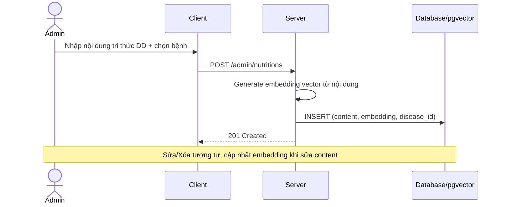

### SD-12: Quản lý người dùng

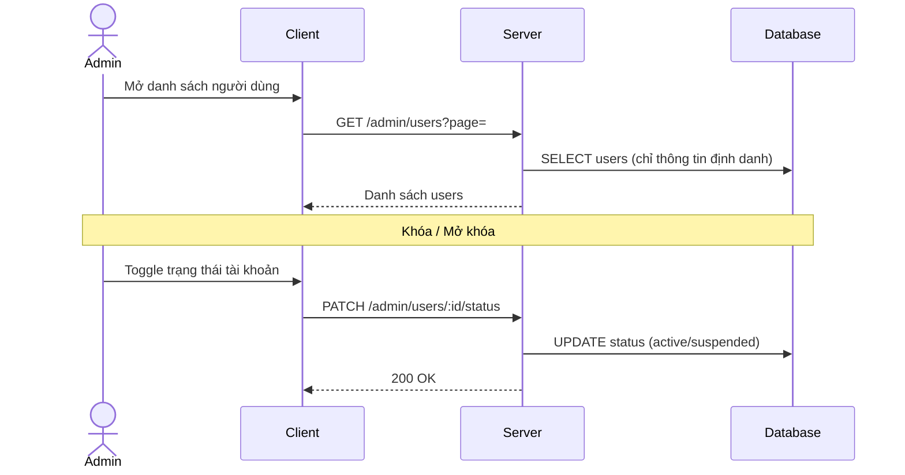

### SD-13: Xử lý phản hồi (Admin)

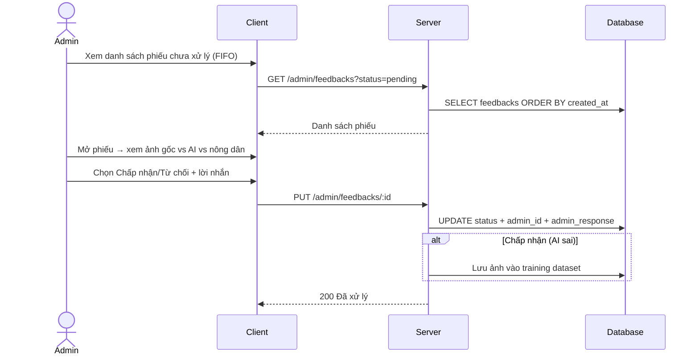

### SD-14: Cập nhật mô hình AI

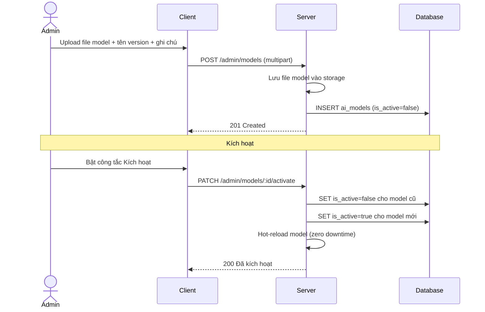

### SD-15: Thống kê & Báo cáo

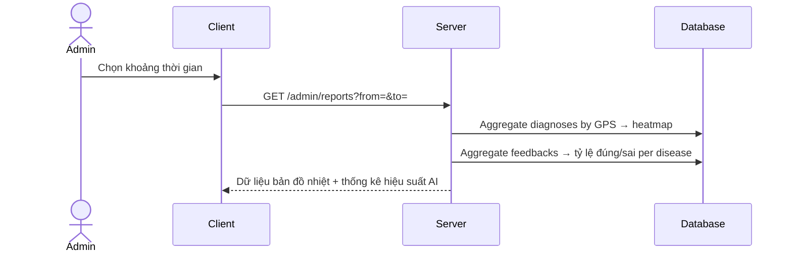

---

## 2.2 Thiết kế CSDL (Updated)

> [!IMPORTANT]
> Thay đổi chính so với v1: Tách Users/UserProfiles, dùng Redis cho login attempts & OTP, pgvector cho Nutritions, bỏ bảng OTPTokens, actual_disease hỗ trợ nhiều bệnh.

### Bảng 1: users

| Trường | Kiểu | Ràng buộc | Ghi chú |
|--------|------|-----------|---------|
| id | UUID | PK | |
| username | VARCHAR | UNIQUE, NOT NULL | Chữ, số, gạch dưới |
| email | VARCHAR | UNIQUE, NOT NULL | |
| password_hash | VARCHAR | NOT NULL | Bcrypt |
| role | ENUM | 'user','admin' | Gọi chung là user |
| status | ENUM | 'active','inactive','suspended' | inactive = chưa verify email |
| created_at | TIMESTAMP | | |

> **Lưu ý:** `failed_login_count` và `locked_until` lưu trên **Redis**, không lưu DB.

### Bảng 2: user_profiles

| Trường | Kiểu | Ràng buộc | Ghi chú |
|--------|------|-----------|---------|
| id | UUID | PK | |
| user_id | FK | → users.id, UNIQUE | 1-1 |
| display_name | VARCHAR | | Họ tên hiển thị |
| gps_lat | DECIMAL | | Vĩ độ mặc định |
| gps_lng | DECIMAL | | Kinh độ mặc định |
| updated_at | TIMESTAMP | | |

### Bảng 3: diseases

| Trường | Kiểu | Ràng buộc | Ghi chú |
|--------|------|-----------|---------|
| id | UUID | PK | |
| name | VARCHAR | UNIQUE, NOT NULL | Tên tiếng Việt |
| scientific_name | VARCHAR | UNIQUE | Tên khoa học |
| symptoms | TEXT | | Mô tả triệu chứng |
| status | ENUM | 'visible','hidden' | |
| created_at | TIMESTAMP | | |

### Bảng 4: nutrition_documents (pgvector)

> Thiết kế dạng vector database cho semantic search / RAG.

| Trường | Kiểu | Ràng buộc | Ghi chú |
|--------|------|-----------|---------|
| id | UUID | PK | |
| disease_id | FK | → diseases.id | Bệnh áp dụng |
| content | TEXT | NOT NULL | Nội dung tri thức DD |
| embedding | VECTOR(1536) | | pgvector embedding |
| metadata | JSONB | | Thông tin bổ sung |
| created_at | TIMESTAMP | | |

### Bảng 5: diagnoses

| Trường | Kiểu | Ràng buộc | Ghi chú |
|--------|------|-----------|---------|
| id | UUID | PK | |
| user_id | FK | → users.id | |
| original_image_url | VARCHAR | NOT NULL | URL ảnh gốc |
| result_image_url | VARCHAR | | URL ảnh có khoanh vùng |
| gps_lat | DECIMAL | | Tọa độ lúc chẩn đoán |
| gps_lng | DECIMAL | | |
| weather_data | JSON | | Dữ liệu thời tiết |
| env_description | TEXT | | Mô tả thực tế (tùy chọn) |
| model_version_id | FK | → ai_models.id | |
| created_at | TIMESTAMP | | |

### Bảng 6: diagnosis_results (1 chẩn đoán → N bệnh)

> Instance Segmentation → dùng mask polygon thay vì bounding box.

| Trường | Kiểu | Ràng buộc | Ghi chú |
|--------|------|-----------|---------|
| id | UUID | PK | |
| diagnosis_id | FK | → diagnoses.id | |
| disease_id | FK | → diseases.id | |
| confidence | DECIMAL | 0-100 | % độ tin cậy |
| mask_polygon | JSON | | Mảng tọa độ polygon [[x1,y1],[x2,y2],...] từ instance segmentation |

### Bảng 7: feedbacks

| Trường | Kiểu | Ràng buộc | Ghi chú |
|--------|------|-----------|---------|
| id | UUID | PK | |
| diagnosis_id | FK | → diagnoses.id | |
| user_id | FK | → users.id | Người gửi |
| actual_diseases | JSON | NOT NULL | Mảng bệnh thực tế (nhiều bệnh) |
| user_message | TEXT | | Lời nhắn nông dân |
| status | ENUM | 'pending','accepted','rejected' | |
| admin_id | FK | → users.id, nullable | Admin xử lý |
| admin_response | TEXT | | Lời nhắn admin gửi lại cho nông dân (ND_QĐ 12) |
| processed_at | TIMESTAMP | | |
| created_at | TIMESTAMP | | |

> **Giải thích `admin_response`:** Theo ND_QĐ 12, nông dân được xem "lời nhắn phản hồi từ Admin" — trường này lưu nội dung đó.

### Bảng 8: ai_models

| Trường | Kiểu | Ràng buộc | Ghi chú |
|--------|------|-----------|---------|
| id | UUID | PK | |
| version_name | VARCHAR | NOT NULL | Tên phiên bản |
| file_path | VARCHAR | NOT NULL | Đường dẫn file |
| release_notes | TEXT | | Ghi chú thay đổi version này |
| is_active | BOOLEAN | Default false | Chỉ 1 active |
| uploaded_by | FK | → users.id | Admin upload |
| created_at | TIMESTAMP | | |

### Redis Keys

| Key Pattern | Mô tả | TTL |
|-------------|--------|-----|
| `login:fail:{username}` | Số lần đăng nhập sai | 15p (user) / 30p (admin) |
| `otp:{email}` | OTP 6 số + attempts count | 10 phút |
| `verify:{token}` | Token xác thực email | 24 giờ |

### ERD Relationships

```
users (1) ────── (1) user_profiles
users (1) ──────< (N) diagnoses
users (1) ──────< (N) feedbacks [as sender]
users (1) ──────< (N) feedbacks [as admin]
diseases (1) ───< (N) nutrition_documents
diseases (1) ───< (N) diagnosis_results
diagnoses (1) ──< (N) diagnosis_results
diagnoses (1) ──< (1) feedbacks
ai_models (1) ──< (N) diagnoses
```

```
[Chèn ảnh ER Diagram tại đây — sẽ tạo từ db.dbml]
```

---

## 2.3 Yêu cầu phi chức năng bổ sung

| # | Loại | Yêu cầu | Metric |
|---|------|---------|--------|
| 1 | Bảo mật | Bcrypt hash, HTTPS | Không plaintext |
| 2 | Bảo mật | Brute-force: Redis lock 15p/30p sau 5 lần sai | Có audit log |
| 3 | Bảo mật | OTP Redis: 6 số, TTL 10p, max 3 attempts | Auto-expire |
| 4 | Bảo mật | Email verification khi đăng ký | Token TTL 24h |
| 5 | Hiệu năng | Chẩn đoán ≤ 7s, OTP ≤ 30s | SLA |
| 6 | Khả dụng | Hot-swap AI model, zero downtime | |
| 7 | Dữ liệu | Ảnh lưu vĩnh viễn cho tái huấn luyện | |
| 8 | Tương thích | Responsive mobile browsers | |
| 9 | Fallback | Weather API timeout → tiếp tục không có thời tiết | |
| 10 | Logging | Audit log hành động admin | |

---

## 2.4 Giải thích thuật ngữ

> Section riêng để giải thích các thuật ngữ kỹ thuật, giúp stakeholder không chuyên cũng nắm được.

| Thuật ngữ | Giải thích |
|-----------|----------|
| **CNN** | Mạng nơ-ron tích chập — thuật toán AI chuyên phân tích hình ảnh |
| **Instance Segmentation** | Kỹ thuật AI khoanh vùng chính xác từng đối tượng bệnh trên ảnh (pixel-level) |
| **pgvector** | Phần mở rộng của PostgreSQL cho phép tìm kiếm ngữ nghĩa trên dữ liệu văn bản |
| **Embedding** | Biểu diễn số của văn bản để máy hiểu nghĩa, phục vụ tìm kiếm thông minh |
| **RAG** | Retrieval-Augmented Generation — truy xuất tri thức để AI tư vấn chính xác hơn |
| **Redis** | Bộ nhớ đệm tốc độ cao, dùng lưu tạm OTP và đếm lần đăng nhập sai |
| **JWT** | Mã thông báo xác thực, giữ trạng thái đăng nhập của người dùng |
| **Bcrypt** | Thuật toán mã hóa mật khẩu một chiều, không thể giải ngược |
| **OTP** | Mã xác thực dùng một lần, gửi qua email, hết hạn sau 10 phút |
| **GPS** | Hệ thống định vị toàn cầu, xác định tọa độ vị trí người dùng |
| **Hot-swap** | Thay thế mô hình AI mà không cần tắt hệ thống |
| **DBML** | Ngôn ngữ mô tả schema database, dùng để sinh ER Diagram tự động |
| **ERD** | Sơ đồ thực thể quan hệ — mô tả cấu trúc và quan hệ giữa các bảng dữ liệu |
| **mask_polygon** | Mảng tọa độ đa giác mô tả đường viền vùng bệnh trên ảnh |

---

# TỔNG KẾT

### Checklist đầy đủ tính năng

**Nông dân (12 tính năng):**

| # | Tính năng | Use Case | Sequence Diagram |
|---|-----------|----------|------------------|
| 1 | Đăng ký tài khoản | UC1 | SD-01 |
| 2 | Đăng nhập hệ thống | UC2 | SD-02 |
| 3 | Khôi phục mật khẩu | UC3 | SD-03 |
| 4 | Xem thông tin cá nhân | UC4 | SD-04 |
| 5 | Chỉnh sửa thông tin cá nhân | UC5 | SD-04 |
| 6 | Gửi ảnh chẩn đoán | UC6 | SD-05 |
| 7 | Nhập thông số môi trường | UC7 | SD-06 |
| 8 | Xem kết quả chẩn đoán | UC8 | SD-05 |
| 9 | Tra cứu lịch sử | UC9 | SD-07 |
| 10 | Xem chi tiết chẩn đoán | UC10 | SD-07 |
| 11 | Gửi phản hồi kết quả | UC11 | SD-08 |
| 12 | Xem kết quả phản hồi | UC12 | SD-09 |

**Quản trị viên (10 tính năng):**

| # | Tính năng | Use Case | Sequence Diagram |
|---|-----------|----------|------------------|
| 1 | Đăng nhập quản trị | UC13 | SD-02 (chung) |
| 2 | Đổi mật khẩu | UC14 | SD-03 (tương tự) |
| 3 | Quản lý bệnh lúa | UC15 | SD-10 |
| 4 | Quản lý tri thức dinh dưỡng | UC16 | SD-11 |
| 5 | Xem danh sách người dùng | UC17 | SD-12 |
| 6 | Khóa / Mở khóa tài khoản | UC18 | SD-12 |
| 7 | Xem danh sách phản hồi | UC19 | SD-13 |
| 8 | Xử lý phản hồi | UC20 | SD-13 |
| 9 | Cập nhật mô hình AI | UC21 | SD-14 |
| 10 | Thống kê & Báo cáo | UC22 | SD-15 |

### Deliverables

| # | Deliverable | File |
|---|-------------|------|
| 1 | Sửa báo cáo LaTeX | `3.0.0.tex` |
| 2 | Database schema | `db.dbml` (tạo mới) |
| 3 | ER Diagram | Sinh từ db.dbml → chèn ảnh vào báo cáo |

> [!IMPORTANT]
> Vui lòng xem xét plan. Nếu chấp thuận, tôi sẽ: (1) tạo `db.dbml`, (2) tạo `task.md` walkthrough, (3) bắt đầu sửa `3.0.0.tex`.
