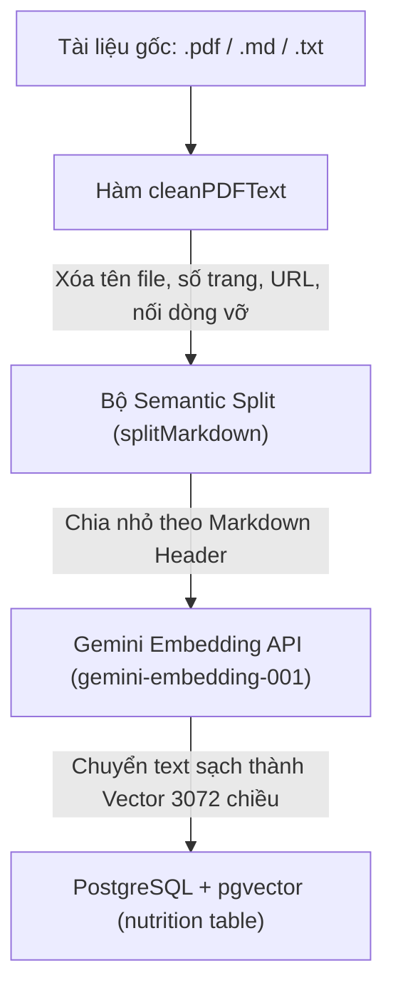

# Tài Liệu Kiến Trúc Và Tính Năng Hệ Thống - Dự Án "Lúa Khỏe"

## 1. Tổng Quan Dự Án

**Lúa Khỏe (LuaKhoe)** là một nền tảng nghiên cứu khoa học và ứng dụng công nghệ cao đặc trị cho ngành nông nghiệp trồng lúa nước. Hệ thống kết hợp sức mạnh của **Thị giác máy tính (Computer Vision - YOLO Instance Segmentation)** và **Trí tuệ nhân tạo tạo sinh (GenAI - Agentic RAG Workflow)** để giúp bà con nông dân và các kỹ sư nông nghiệp phát hiện bệnh hại trên lá lúa theo thời gian thực, đồng thời cung cấp phác đồ điều trị dinh dưỡng an toàn, chính xác và hiệu quả.

---

## 2. Kiến Trúc Công Nghệ Thực Tế (Tech Stack)

Hệ thống được thiết kế theo mô hình Microservices / Phân rã chức năng để tối ưu hóa hiệu năng, tách biệt luồng xử lý tính toán nặng (AI Inference) khỏi luồng nghiệp vụ và GenAI (Orchestration & RAG):

- **Frontend Client (Next.js 16.1.1 App Router & React 19.2.3):** Sử dụng React, Tailwind CSS v4 để tối ưu hóa giao diện di động/máy tính, Ant Design v6 cho hệ thống quản trị (Admin Panel), Recharts cho Dashboard, và Leaflet Maps để định vị ruộng đất.
- **Backend Orchestrator (NestJS):** Đóng vai trò là cổng điều phối trung tâm, kiểm soát bảo mật, phân quyền, quản lý cơ sở dữ liệu quan hệ qua TypeORM, tích hợp bộ đệm (Caching) phân tán bằng Redis, và **chạy trực tiếp luồng đồ thị Agentic RAG bằng LangGraph**.
- **AI Inference Service (FastAPI):** Chuyên trách xử lý chạy mô hình học sâu YOLO (định dạng ONNX) qua thư viện `ultralytics` để phân vùng vết bệnh (Instance Segmentation), đồng thời thực hiện bộ hiệu chỉnh điểm số môi trường (Environmental Adjustment) dựa trên bối cảnh thời tiết và thông số ruộng lúa.
- **Database Vector & Relational (PostgreSQL + pgvector):** Lưu trữ toàn bộ dữ liệu thực thể của hệ thống, đồng thời hỗ trợ lưu trữ và tìm kiếm vector tiệm cận 3072 chiều (`VECTOR(3072)`) cho kho tri thức dinh dưỡng thông qua mô hình Gemini Embedding.

---

## 3. Các Tính Năng Cốt Lõi Phân Hệ Admin & Người Dùng

### 3.1. Phân Hệ Người Dùng (Nông Dân / Hợp Tác Xã)

1.  **Chẩn Đoán Bệnh Đa Phương Thức (Multimodal Diagnosis):** Tải lên hình ảnh lá lúa bị bệnh trực tiếp từ thực địa. Hệ thống tự động đồng bộ hóa tọa độ GPS gửi kèm với thông số thời tiết và thông tin ruộng đất để đưa ra kết luận chuẩn xác.
2.  **Quản Lý Đa Vị Trí Ruộng Đất (Shopee-style Field Book):**
    - Cho phép người dùng tạo và quản lý danh sách nhiều mảnh ruộng khác nhau thông qua giao diện Profile.
    - Hỗ trợ ghim trực tiếp tọa độ vật lý chính xác cao `decimal(10,8)` (Latitude) và `decimal(11,8)` (Longitude) trên Bản đồ Leaflet.
    - Thiết lập một ruộng làm mặc định (isDefault: true) đóng vai trò là nguồn dữ liệu duy nhất (Single Source of Truth) cho tọa độ mặc định của nông dân.
3.  **Luồng UX Chẩn Đoán Thông Minh 3 Trạng Trái:** Khi chẩn đoán, người dùng được chọn nhanh:
    - _Sử dụng ruộng mặc định:_ Ẩn bản đồ hoàn toàn để giao diện gọn gàng nhất.
    - _Chọn từ danh sách ruộng đã lưu:_ Hiển thị dropdown các mảnh ruộng khác để lấy nhanh tọa độ mà không cần mở bản đồ.
    - _Chẩn đoán tại vị trí mới:_ Sổ bản đồ và nút lấy GPS định vị thực thời từ thiết bị di động.
4.  **Diễn Đàn Giao Lưu & Hỏi Đáp (Farmer Forum):**
    - Cho phép nông dân viết bài đăng, đính kèm hình ảnh và thẻ tags để chia sẻ kinh nghiệm canh tác hoặc hỏi đáp bệnh hại.
    - Tương tác thông qua nút `👍 Hữu ích` (Helpful) và `👎 Không hữu ích` (Not Helpful) với cơ chế Optimistic UI cập nhật tức thời không trễ (zero-latency).
    - Tự động hiển thị câu trả lời tốt nhất (Top Solution Sneak Peek) trực tiếp dưới bài viết nếu bình luận đó có điểm đánh giá tích cực (`upvotes - downvotes > 0`), hoạt động theo cơ chế trích dẫn và không ẩn bình luận gốc ở danh sách dưới để bảo toàn luồng thảo luận.
    - Tích hợp tính năng phân trang thu gọn/mở rộng bình luận (Show More / Hide) ở cả danh sách bình luận chính và các phản hồi con đệ quy để tối ưu hóa diện tích hiển thị trên điện thoại.

### 3.2. Phân Hệ Quản Trị Viên (Admin Panel)

1.  **Kiểm Soát Quyền Truy Cập (Role Access Control):** Bảo vệ các tuyến đường vùng admin (`/admin/*`) nghiêm ngặt tại `AdminLayout` Client Boundary. Khi đang xác thực, hệ thống hiển thị trạng thái kiểm tra dạng Loading Spinner tự động (`Đang xác thực quyền truy cập...`), chặn đứng hiện tượng loé nội dung (content flash).
2.  **Quản Lý Người Dùng & Điều Hướng Linh Hoạt:**
    - Xem danh sách nông dân kèm các chỉ số thống kê động.
    - Hỗ trợ Khóa/Mở khóa tài khoản (Ban/Unban) đi kèm lưu trữ lý do cấm (`statusReason`) và thời gian phạt vào cột `metadata`.
    - Tích hợp nút chuyển đổi giao diện _"👀 Xem giao diện Nông dân"_ mở tab mới bảo mật (`target="_blank"`, `rel="noopener noreferrer"`) trên Header của Admin Layout.
    - Tích hợp nút _"⚙️ Quay lại Dashboard"_ trên thanh điều hướng người dùng (chỉ hiển thị khi tài khoản đăng nhập có quyền `ROLE.ADMIN`).
3.  **Cơ Sở Tri Thức Dinh Dưỡng Kế Thừa (Nutrition Knowledge Base CRUD):**
    - Quản lý các đoạn tri thức phục vụ mô hình RAG. Hỗ trợ nạp văn bản thủ công hoặc kéo thả file `.txt`, `.md`, `.pdf`.
    - Tích hợp bộ tiền xử lý dữ liệu động chuyên sâu (`cleanPDFText`) để quét sạch các nhiễu số trang độc lập (`-- 1 of 3 --`), URL hệ thống lặp lại, văn bản UI rác ("Thu gọn", "Xem thêm"), và hàn gắn các dòng đứt gãy từ file PDF giúp bảo toàn nguyên vẹn các công thức tỉ lệ hóa chất nghiệp vụ dạng phân số (như `1/2`, `1/3`).
    - Tích hợp bộ phân tách Semantic Split (`splitMarkdown`) theo cấu trúc Markdown Header `#`, `##`, `###` để tạo ra các chunk tri thức chất lượng cao.
4.  **Cấu Hình Hệ Thống Động (System Configurations):**
    - Giao diện thay đổi các tham số hệ thống động được lưu trữ trực tiếp vào bảng `system_configs` của PostgreSQL và tự động đồng bộ hóa lên Redis Cache mà không cần deploy lại mã nguồn:
      - `CONFIDENCE_THRESHOLD`: Ngưỡng cảnh báo độ tin cậy thấp (Mặc định: `0.75`).
      - `MAX_IMAGE_SIZE_MB`: Kích thước ảnh tối đa cho phép tải lên (Mặc định: `10MB`).
      - `RAG_CONTEXT_WINDOW`: Số lượng chunk tri thức tối đa được nạp vào RAG Context (Mặc định: `5`).
      - `WEATHER_CACHE_TTL_MINUTES`: Thời gian lưu bộ đệm thời tiết trong bộ nhớ (Mặc định: `30`).
      - `MAX_DIAGNOSIS_PER_DAY`: Giới hạn lượt chẩn đoán tối đa của mỗi nông dân trong ngày (Mặc định: `50`).
5.  **Lựa Chọn Phiên Bản Mô Hình AI Động (User AI Model Selection):**
    - Cho phép người dùng trực tiếp chọn phiên bản mô hình AI khi thực hiện chẩn đoán (thay vì cố định bởi cấu hình Admin).
    - Danh sách mô hình AI hoạt động được truy vấn động từ bảng `ai_models` thông qua API `GET /ai-models/active` (sắp xếp theo ngày tạo mới nhất).
    - Tích hợp các ràng buộc bảo mật: Chặn sử dụng các mô hình đã bị Admin tắt (`isActive = false`) bằng lỗi `BadRequestException`, và tự động fallback về mô hình hoạt động mới nhất nếu không truyền tham số lựa chọn.

---

## 4. Luồng Hoạt Động Hệ Thống (Workflows & Pipelines)

### 4.1. Luồng Nạp Tri Thức (Knowledge Ingestion Pipeline)

### 4.2. Luồng Chẩn Đoán & Khuyến Nghị Agentic RAG

1.  **Bước 1 - Upload ảnh & Lựa Chọn Mô Hình AI:** Người dùng gửi yêu cầu chẩn đoán kèm tệp tin hình ảnh lá lúa và khóa định danh mô hình AI (`modelVersionId`) tùy chọn được chọn từ giao diện.
2.  **Bước 2 - Lấy tọa độ & địa lý:** NestJS phân tích tọa độ ruộng lúa. Nếu có `fieldId`, hệ thống tự động truy vấn bảng `user_fields` để lấy tọa độ. Sau đó, chạy bộ định vị ngược **Reverse Geocoding** trên Backend để phân tách ra Tỉnh/Thành phố (`geocodedProvince`) có tích hợp bộ đệm Redis `geocodeCacheKey(lat, lng)` để tránh quá tải API Nominatim.
3.  **Bước 3 - Điều phối thời tiết & Bộ đệm:** NestJS Backend lấy thông tin thời tiết. Hệ thống sử dụng bộ đệm phân tán Redis (được định dạng key tập trung qua `weatherCacheKey(lat, lng)` làm tròn đến 2 chữ số thập phân, lưới ~1.1km) với thời gian sống lấy từ cấu hình hệ thống (mặc định **30 phút (TTL)**). Nếu hết hạn, gọi API Open-Meteo để lấy thông tin nhiệt độ, độ ẩm thực tế.
4.  **Bước 4 - Dự đoán & Hiệu chỉnh điểm số (FastAPI Microservice):**
    - NestJS phân giải mô hình AI được chạy: nếu người dùng truyền `modelVersionId`, hệ thống kiểm tra bảo mật (ném lỗi nếu mô hình bị tắt), nếu không truyền thì tự động chọn mô hình hoạt động mới nhất.
    - NestJS gọi API `/predict` của FastAPI AI Service, truyền kèm URL ảnh, dữ liệu bối cảnh thời tiết/môi trường, và phiên bản mô hình AI cụ thể (`ai_model_version`).
    - FastAPI kích hoạt mô hình YOLO ONNX tương ứng để phân vùng vết bệnh hại.
    - Áp dụng bộ hiệu chỉnh môi trường (`adjust_prediction` trong Python) sử dụng các luật sinh học từ **IRRI Rice Knowledge Bank** và **UF/IFAS EDIS** để tinh chỉnh điểm tin cậy (Confidence Score) của YOLO dựa trên nhiệt độ, độ ẩm thực tế, sương mù, mật độ gieo sạ, giai đoạn tăng trưởng, rầy nâu, và lịch sử phun thuốc.
    - FastAPI vẽ bounding box, mask và nhãn lên ảnh, trả ảnh kết quả dạng base64 kèm danh sách vết bệnh đã được hiệu chỉnh độ tin cậy và tỷ lệ diện tích bị nhiễm bệnh (`affected_area_ratio`).
5.  **Bước 5 - Lưu trữ & Persist:** NestJS Backend tải ảnh base64 kết quả lên Cloudinary, lưu trữ bản ghi vào bảng `diagnoses` (ghi nhận khóa ngoại `model_version_id`) và từng kết quả vết bệnh chi tiết vào bảng `diagnosis_results`.
6.  **Bước 6 - Luồng Đồ thị Agentic RAG (Chạy trên NestJS Backend):**
    - Hệ thống khởi chạy đồ thị **LangGraph StateGraph** với 2 nút chính: `retrieve` và `generate`.
    - **Node Retrieve:** Dựa trên danh sách các bệnh phát hiện được (sắp xếp theo diện tích lây nhiễm giảm dần), hệ thống gọi **Google Generative AI Embeddings (`models/gemini-embedding-001`)** để chuyển hóa chuỗi truy vấn thành vector 3072 chiều. Chạy câu truy vấn pgvector khoảng cách Cosine (`<=>`) xuống bảng `nutritions` với `LIMIT 3` đoạn tri thức gần nhất cho mỗi bệnh.
    - **Deduplication & Fusion:** Tiến hành gộp các đoạn ngữ cảnh và khử trùng lặp theo ID tài liệu để tiết kiệm tối đa cửa sổ ngữ cảnh (Context Window).
    - **Node Generate:** Bơm toàn bộ Text tri thức sạch kèm dữ liệu định lượng (`affected_area_ratio`) của YOLO và bối cảnh đồng ruộng vào Prompt hệ thống. Gọi mô hình **ChatGroq (Llama 3 / GPT-OSS)** hoạt động ở nhiệt độ thấp (`temperature: 0.4`) để triệt tiêu hiện tượng ảo tưởng.
    - **Safety check & JSON Force:** Prompt ép buộc AI kiểm tra an toàn hóa học (Ví dụ: Tuyệt đối không tự ý phối trộn thuốc gốc Đồng với thuốc sinh học hoặc các hoạt chất kỵ nhau, cảnh báo khoảng cách ngày phun). Kết quả trả về bắt buộc phải là một chuỗi JSON đúng chuẩn cấu trúc (chứa các trường `summary`, `disease_name`, `severity_assessment`, `immediate_actions`, `treatment_protocol` với các mảng `biological`, `chemical`, `cultural`, `npk_adjustment`, `prevention_measures`).
    - **Persist Advisory:** Khuyến nghị RAG JSON sau đó được **lưu trữ trực tiếp** vào cột `advisory` của bảng `diagnosis_results` cho bệnh có diện tích nhiễm nặng nhất để tránh việc phải tái tạo lại dữ liệu khi xem lịch sử.
7.  **Bước 7 - Render UI:** Giao diện Next.js đón nhận chuỗi Markdown trong RAG Advisory, dùng bộ xử lý hiển thị trực quan lên thẻ `TreatmentProtocolCard` và ẩn các câu cảnh báo độ tin cậy thấp nếu điểm số đạt trên ngưỡng cấu hình hệ thống (`>= 0.75`).

### 4.3. Luồng Tương Tác & Tải Bình Luận Diễn Đàn (Forum Interactions & Pagination Pipeline)

1.  **Luồng lấy danh sách bài viết & Tối ưu hóa N+1 (Get Feed & Top Solution):**
    - Khi truy cập `/forum`, Next.js Client gọi API `GET /forum/posts?page=1&limit=10&sort=hot`.
    - NestJS Backend thực thi câu lệnh SQL với `LEFT JOIN LATERAL` để truy vấn trực tiếp bình luận có điểm số cao nhất (`upvotes - downvotes > 0` và `parent_id IS NULL`) làm **Top Comment** cho từng bài viết trong duy nhất 1 query.
    - Đồng thời, chạy `LEFT JOIN` với bảng `post_votes` theo `currentUserId` của người dùng đang đăng nhập để trả về trạng thái `userVote` (`'up' | 'down' | null`).
    - Next.js Client nhận danh sách, hiển thị bài đăng cùng khung trích dẫn **"✨ Giải pháp được cộng đồng đánh giá cao nhất"** (nếu có `topComment`) ngay dưới nội dung chính của PostCard.
2.  **Luồng tương tác Vote Lạc quan (Optimistic UI Vote):**
    - Khi người dùng bấm `👍 Hữu ích` hoặc `👎 Không hữu ích`:
      - **Frontend (Client-side):** Sử dụng trạng thái vote hiện tại (`userVote`) và số đếm hiện hành để tính toán số đếm mới ngay lập tức (Optimistic Update) và chuyển màu nút tương ứng (Green cho Upvote, Red cho Downvote) mà không chờ phản hồi mạng.
      - **API Request:** Frontend gửi yêu cầu `POST /forum/posts/:id/vote` hoặc `/forum/comments/:id/vote` kèm payload `{ type: 'up' | 'down' }`.
      - **Backend (Transaction Toggle):** NestJS nhận yêu cầu, kích hoạt database transaction để kiểm tra trạng thái vote cũ của user, thực hiện toggle cập nhật điểm số thích hợp (hủy vote, đổi vote, hoặc vote mới) trong cùng transaction. Nếu API lỗi, Frontend tự động rollback giao diện về trạng thái trước khi click.
3.  **Luồng hiển thị & Phân trang bình luận (Show More / Hide):**
    - Khi click nút bình luận trên PostCard, hệ thống hiển thị danh sách bình luận của bài viết.
    - **Tải bình luận cấp 1:** Gọi `GET /forum/posts/:id/comments?page=1&limit=3` để lấy danh sách bình luận cha (`parent_id IS NULL`).
    - **Phản hồi con đệ quy (Replies):** Mỗi bình luận cấp 1 chứa mảng `replies` (sắp xếp theo `createdAt ASC`) và chỉ hiển thị tối đa 3 phản hồi con ban đầu.
    - **Cơ chế "Xem thêm/Thu gọn" (Show More / Hide):**
      - Nếu số lượng bình luận/phản hồi thực tế lớn hơn số đang hiển thị, giao diện render nút `Hiển thị thêm (X)` (trong đó X là số lượng còn lại). Bấm vào sẽ tăng số lượng hiển thị lên (+5 bình luận mỗi lần bấm).
      - Nếu đã hiển thị hết, xuất hiện nút `Thu gọn` để xếp gọn mạch thảo luận về giới hạn ban đầu (3 bình luận), tối ưu hóa trải nghiệm lướt màn hình dọc trên thiết bị di động.

---

## 5. Quy Trình Kiểm Thử & Xác Minh (Verification Plan)

Để đảm bảo các tính năng hoạt động đồng bộ và không phát sinh lỗi hồi quy, hệ thống áp dụng quy trình kiểm thử 2 lớp:

1.  **Kiểm thử tự động (Automated Verification):**
    - _Frontend:_ Chạy lệnh `npx tsc --noEmit` và `npm run lint` kiểm tra toàn bộ tính toàn vẹn của kiểu dữ liệu (Typescript Props) và chuẩn quy hoạch mã nguồn.
    - _Backend:_ Chạy `npm run build` để kiểm tra khả năng biên dịch của NestJS, đảm bảo các quan hệ khóa ngoại (Cascade, Transactions) được cấu hình chuẩn xác.
2.  **Kiểm thử thủ công (Manual Verification):**
    - _Xác thực phân quyền:_ Đăng nhập tài khoản nông dân thường, gõ trực tiếp URL `/admin/users` trên thanh trình duyệt, xác minh hệ thống tự động điều hướng đá ngược về trang `/diagnose` mà không bị lộ bất kỳ giao diện quản trị nào.
    - _Xác thực ruộng mặc định:_ Thêm mới một mảnh ruộng trên trang Profile, tích chọn "Lưu mặc định", kiểm tra trong DB xem bản ghi `user_fields` có thuộc tính `is_default` được thiết lập thành `true` hay chưa, đồng thời truy cập trang Chẩn đoán xem tọa độ của ruộng mặc định này có tự động tải thành công hay không.
    - _Xác thực dọn rác PDF:_ Upload một file PDF chứa thông số kỹ thuật của viện nghiên cứu, kiểm tra các câu hiển thị trong bảng admin xem đã bốc hơi hoàn toàn các ký tự số trang rác như `-- 1 of 3 --` nhưng vẫn giữ nguyên vẹn các công thức pha chế tỷ lệ dạng `1/2`, `1/3` hay không.
    - _Xác thực Tương tác Diễn đàn (Forum):_
      - _Optimistic UI Vote:_ Nhấp nút `👍 Hữu ích` hoặc `👎 Không hữu ích`, xác thực số điểm cập nhật ngay lập tức mà không có hiện tượng chớp nháy (flicker). Chặn mạng (Simulate Offline) và bấm vote, xác nhận giao diện hiển thị thông báo lỗi và tự động khôi phục số điểm ban đầu.
      - _Top Comment Sneak Peek:_ Tạo một bài đăng và 2 bình luận. Upvote bình luận thứ hai đạt điểm dương cao hơn bình luận thứ nhất. Tải lại trang Feed, xác nhận bình luận thứ hai xuất hiện nổi bật tại ô "Giải pháp được đánh giá cao nhất" với badge viền màu xanh lá cây đặc trưng.
      - _Tránh bình luận mồ côi (Orphaned Replies):_ Kiểm tra xem các bình luận trả lời con (Replies) của Top Comment có hiển thị bình thường khi xem trong danh sách bình luận chi tiết hay không.
      - _Show More / Hide:_ Viết hơn 5 bình luận cho bài đăng, xác minh giao diện ban đầu chỉ hiện 3 bình luận kèm nút "Xem thêm (còn lại 2+)". Nhấp nút "Xem thêm", xác nhận danh sách mở rộng đầy đủ. Nhấp nút "Thu gọn", xác nhận danh sách thu nhỏ về đúng 3 mục.

---

## 6. Kiến Trúc Bộ Đệm & Cơ Chế Giải Quyết Phụ Thuộc Vòng (Caching & Modular Architecture)

### 6.1. Kiến trúc Caching phân tán bằng Redis

Hệ thống sử dụng Redis làm bộ nhớ đệm phân tán để nâng cao hiệu năng và độ ổn định. Tất cả các cache key được tập trung định nghĩa tại [cache-key.ts](file:///d:/CODE%20PLAYGROUND/Projects/Fullstack/Project_LuaKhoe/LuaKhoe-backend/src/shared/cache-key.ts) bao gồm:

- **`systemConfigCacheKey(key)`**: Cache cấu hình hệ thống động để giảm tải truy vấn DB.
- **`geocodeCacheKey(lat, lng)`**: Cache kết quả reverse geocoding tọa độ ruộng lúa.
- **`weatherCacheKey(lat, lng)`**: Cache dữ liệu thời tiết Open-Meteo.
- **`failedAttemptCacheKey(userId, route)`** và **`rateLimitCacheKey(method, endpoint, ip)`**: Phục vụ bảo mật, chặn spam API.
- **`otpCacheKey`** và **`resetPasswordCacheKey`**: Quản lý OTP và khôi phục mật khẩu.

_Lưu ý:_ Các `Map` xử lý logic tạm thời trong phạm vi vòng đời request (như `countMap`, `provinceMap` gom nhóm thống kê hoặc các Map khử trùng lặp dữ liệu) được giữ nguyên in-memory trên RAM Node.js để tối ưu tốc độ tính bằng nanosecond.

### 6.2. Cơ chế Giải Quyết Phụ Thuộc Vòng (Circular Dependency)

Khi tích hợp `SystemConfigModule` vào `GeoContextModule`, hệ thống xuất hiện vòng lặp dependencies:
`UserModule` ➡️ `GeoContextModule` ➡️ `SystemConfigModule` ➡️ `UserModule` (do `AuthGuard` bảo mật cần `UserService`).

- **Giải pháp**: Khai báo `UserModule` là **Global Module** thông qua `@Global()`. Giải pháp này cho phép mọi module khác trong ứng dụng (bao gồm cả `SystemConfigModule` cho Guards) tự động giải quyết phụ thuộc vào `UserService` mà không cần phải import `UserModule`, bẻ gãy hoàn toàn vòng phụ thuộc mà không cần dùng đến cấu trúc `forwardRef()` phức tạp.

---

## 7. Kiến Trúc Lưu Trữ Độc Lập & Hệ Thống MLOps Nâng Cao (Storage & MLOps Pipeline)

### 7.1. Kiến Trúc Lưu Trữ Storage Provider Pattern & Cloudflare R2

Để xây dựng một hệ thống linh hoạt, độc lập với nhà cung cấp dịch vụ đám mây (cloud-agnostic), hệ thống "Lúa Khỏe" áp dụng **Storage Provider Pattern** (kết hợp mẫu thiết kế Facade và Factory):

- **Interface Hợp Đồng (`IStorageProvider`)**: Định nghĩa các phương thức nghiệp vụ chung `uploadFile`, `deleteFile`, và `uploadBase64Image` mà mọi nhà cung cấp cụ thể bắt buộc phải tuân thủ.
- **Concrete Providers (Cloudflare R2 & Cloudinary)**:
  - **`R2StorageProvider`**: Sử dụng AWS SDK Client S3 để lưu trữ các tệp nhị phân nặng như tệp mô hình học sâu YOLO `.onnx` (`raw` resource type) trực tiếp lên Cloudflare R2 nhằm tối ưu hóa chi phí băng thông tải về (zero egress fees).
  - **`CloudinaryStorageProvider`**: Tối ưu hóa việc tải ảnh (avatar nông dân, ảnh lá lúa thực địa, ảnh kết quả phân vùng) bằng cơ chế CDN phân phối toàn cầu, tự động cắt tỉa kích thước và định dạng hình ảnh.
- **Factory Orchestrator (`StorageService`)**: Tự động định tuyến luồng lưu trữ động dựa trên tham số `StorageType` truyền vào mà không để lộ cấu trúc hạ tầng cơ sở cho các Controllers hay Services nghiệp vụ khác.
- **Dọn dẹp tài nguyên thông minh**: Tích hợp cơ chế tự động phân giải cấu trúc URL CDN/R2 để lấy khóa nhận dạng (Public ID/S3 Key) phục vụ dọn dẹp (delete) tệp cũ trên đám mây khi có hành động xóa hoặc ghi đè mô hình/ảnh hồ sơ.

### 7.2. Hệ Thống Quản Lý AI Model & RAM Safe-Guard (MLOps Pipeline)

Phân hệ quản lý MLOps được nâng cấp toàn diện để đáp ứng các tiêu chuẩn vận hành sản xuất:

1.  **Multi-Session RAM Management**: Chuyển đổi biến lưu trữ đơn lẻ thành một `sessions: Map<string, InferenceSession>` trong RAM, cho phép hệ thống tải và chạy đồng thời nhiều phiên bản mô hình AI khác nhau.
2.  **Smart Local Caching**: Khi kích hoạt một mô hình, hệ thống kiểm tra sự tồn tại của tệp `.onnx` trong thư mục bộ đệm cục bộ (`.models_cache/${id}.onnx`). Nếu đã tồn tại, bỏ qua bước tải từ Cloudflare R2 để tăng tốc độ nạp RAM từ vài phút xuống microsecond.
3.  **RAM Safe-Guard (FIFO Eviction Queue)**: Để tránh tình trạng tràn RAM (Out-of-Memory) do nạp các tệp mô hình lớn nặng 94MB trên máy chủ giới hạn, hệ thống sử dụng cờ cấu hình `MAX_CONCURRENT_MODELS` (mặc định: `1`). Khi số lượng session vượt ngưỡng, mô hình cũ nhất trong hàng đợi `sessionQueue` sẽ bị tự động thu hồi (evict) và giải phóng khỏi RAM qua bộ gom rác V8.
4.  **Cơ chế Toggle Đứt Điểm & Khóa Chống Race Condition**:
    - Cho phép Admin bật/tắt tự do các mô hình mà không bị khóa cứng. Khi kích hoạt mô hình (`isActive = true`), hệ thống tải tệp và nạp vào RAM. Khi tắt (`isActive = false`), dọn dẹp session và thu hồi RAM tức thì.
    - Phía Backend tích hợp Set khóa bảo vệ `loadingModels` trong `AiService`. Nếu mô hình đang trong tiến trình tải hoặc nạp RAM, mọi yêu cầu kích hoạt kế tiếp cho mô hình đó sẽ lập tức bị từ chối với lỗi **HTTP 429 Too Many Requests**. Giao diện Admin cũng tự động disable các nút tương ứng để ngăn chặn thao tác spam từ người dùng.
5.  **Cơ chế Chỉnh Sửa & Hot-Reload Swapping An Toàn**:
    - Hỗ trợ API `PATCH /ai-models/:id` cho phép cập nhật thông tin mô tả và thay thế tệp nhị phân `.onnx` tùy chọn.
    - Áp dụng cơ chế sản xuất an toàn **Upload-First, Delete-Later**: Tải tệp mới lên R2 thành công trước, lưu trữ DB thành công, sau đó mới xóa tệp cũ trên đám mây để ngăn ngừa rủi ro mất mát dữ liệu khi tải lên thất bại giữa chừng.
    - Tự động xóa tệp cục bộ trên máy chủ để cưỡng chế tải lại phiên bản mới, đồng thời thực hiện Hot-Reload RAM Swap: giải phóng session cũ và nạp lại mô hình mới vào bộ nhớ không cần khởi động lại Server.

### 7.3. Đồng Bộ Hóa Dữ Liệu Bộ Đệm & Seeder Hạt Giống

1.  **Weather Cache Parse String**: Khắc phục triệt để lỗi lệch kiểu dữ liệu khi lưu thông tin thời tiết trong Redis bằng cách thực hiện `JSON.stringify(weatherData)` khi ghi vào bộ đệm và gọi hàm phân giải an toàn `tryParseStringIntoCorrectData` của thư viện `mvc-common-toolkit` khi truy xuất dữ liệu.
2.  **Disease Database Seeder**: Tích hợp module gieo hạt tự động `DiseaseSeederService` tự động khởi tạo dữ liệu chuẩn khoa học của 5 nhóm bệnh hại lá lúa nguy hiểm nhất tại Việt Nam (Đạo ôn, Bạc lá, Đốm nâu, Vàng lụi, Khô vằn) theo tài liệu của **Viện Nghiên cứu Lúa Quốc tế (IRRI)** ngay khi hệ thống khởi chạy lần đầu tiên.
