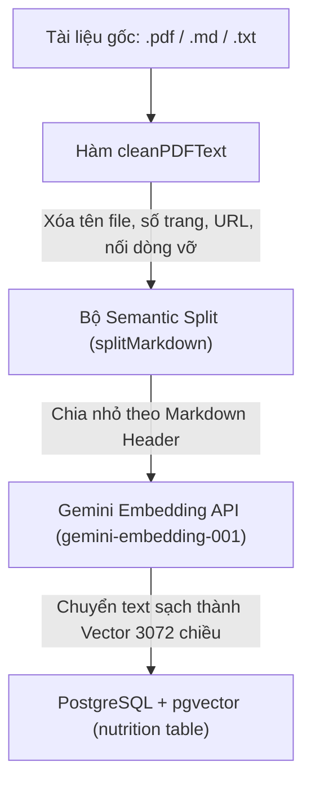

# Tài Liệu Kiến Trúc Và Tính Năng Hệ Thống - Dự Án "Lúa Khỏe"

## 1. Tổng Quan Dự Án

**Lúa Khỏe (LuaKhoe)** là một nền tảng nghiên cứu khoa học và ứng dụng công nghệ cao đặc trị cho ngành nông nghiệp trồng lúa nước. Hệ thống kết hợp sức mạnh của **Thị giác máy tính (Computer Vision - YOLO Instance Segmentation)** và **Trí tuệ nhân tạo tạo sinh (GenAI - Agentic RAG Workflow)** để giúp bà con nông dân và các kỹ sư nông nghiệp phát hiện bệnh hại trên lá lúa theo thời gian thực, đồng thời cung cấp phác đồ điều trị dinh dưỡng an toàn, chính xác và hiệu quả.

---

## 2. Kiến Trúc Công Nghệ Thực Tế (Tech Stack)

Hệ thống được thiết kế theo mô hình Microservices / Phân rã chức năng để tối ưu hóa hiệu năng, tách biệt luồng xử lý tính toán nặng (AI Inference) khỏi luồng nghiệp vụ và GenAI (Orchestration & RAG):

- **Frontend Client (Next.js 16.1.1 App Router & React 19.2.3):** Sử dụng React, Tailwind CSS v4 để tối ưu hóa giao diện di động/máy tính, Ant Design v6 cho hệ thống quản trị (Admin Panel), Recharts cho Dashboard, và Leaflet Maps để định vị ruộng đất.
- **Backend Orchestrator (NestJS):** Đóng vai trò là cổng điều phối trung tâm, kiểm soát bảo mật, phân quyền, quản lý cơ sở dữ liệu quan hệ qua TypeORM, tích hợp bộ đệm (Caching) thời tiết, và **chạy trực tiếp luồng đồ thị Agentic RAG bằng LangGraph**.
- **AI Inference Service (FastAPI):** Chuyên trách xử lý chạy mô hình học sâu YOLO (định dạng ONNX) qua thư viện `ultralytics` để phân vùng vết bệnh (Instance Segmentation), đồng thời thực hiện bộ hiệu chỉnh điểm số môi trường (Environmental Adjustment) dựa trên bối cảnh thời tiết và thông số ruộng lúa.
- **Database Vector & Relational (PostgreSQL + pgvector):** Lưu trữ toàn bộ dữ liệu thực thể của hệ thống, đồng thời hỗ trợ lưu trữ và tìm kiếm vector tiệm cận 3072 chiều (`VECTOR(3072)`) cho kho tri thức dinh dưỡng thông qua mô hình Gemini Embedding.

---

## 3. Các Tính Năng Cốt Lõi Phân Hệ Admin & Người Dùng

### 3.1. Phân Hệ Người Dùng (Nông Dân / Hợp Tác Xã)

1.  **Chẩn Đoán Bệnh Đa Phương Thức (Multimodal Diagnosis):** Tải lên hình ảnh lá lúa bị bệnh trực tiếp từ thực địa. Hệ thống tự động đồng bộ hóa tọa độ GPS gửi kèm với thông số thời tiết và thông tin ruộng đất để đưa ra kết luận chuẩn xác.
2.  **Quản Lý Đa Vị Trí Ruộng Đất (Shopee-style Field Book):**
    - Cho phép người dùng tạo và quản lý danh sách nhiều mảnh ruộng khác nhau thông qua giao diện Profile.
    - Hỗ trợ ghim trực tiếp tọa độ vật lý chính xác cao `decimal(10,8)` (Latitude) và `decimal(11,8)` (Longitude) trên Bản đồ Leaflet.
    - Thiết lập một ruộng làm mặc định, tự động đồng bộ hóa với thông tin `UserProfile`.
3.  **Luồng UX Chẩn Đoán Thông Minh 3 Trạng Trái:** Khi chẩn đoán, người dùng được chọn nhanh:
    - _Sử dụng ruộng mặc định:_ Ẩn bản đồ hoàn toàn để giao diện gọn gàng nhất.
    - _Chọn từ danh sách ruộng đã lưu:_ Hiển thị dropdown các mảnh ruộng khác để lấy nhanh tọa độ mà không cần mở bản đồ.
    - _Chẩn đoán tại vị trí mới:_ Sổ bản đồ và nút lấy GPS định vị thực thời từ thiết bị di động.

### 3.2. Phân Hệ Quản Trị Viên (Admin Panel)

1.  **Kiểm Soát Quyền Truy Cập (Role Access Control):** Bảo vệ các tuyến đường vùng admin (`/admin/*`) nghiêm ngặt tại `AdminLayout` Client Boundary. Khi đang xác thực, hệ thống hiển thị trạng thái kiểm tra dạng Loading Spinner tự động (`Đang xác thực quyền truy cập...`), chặn đứng hiện tượng loé nội dung (content flash).
2.  **Quản Lý Người Dùng & Điều Hướng Linh Hoạt:**
    - Xem danh sách nông dân kèm các chỉ số thống kê động.
    - Hỗ trợ Khóa/Mở khóa tài khoản (Ban/Unban) đi kèm lưu trữ lý do cấm (`statusReason`) và thời gian phạt vào cột `metadata`.
    - Tích hợp nút chuyển đổi giao diện _"👀 Xem giao diện Nông dân"_ mở tab mới bảo mật (`target="_blank"`, `rel="noopener noreferrer"`) trên Header của Admin Layout.
    - Tích hợp nút _"⚙️ Quay lại Dashboard"_ trên thanh điều hướng người dùng (chỉ hiển thị khi tài khoản đăng nhập có quyền `ROLE.ADMIN`).
3.  **Cơ Sở Tri Thức Dinh Dưỡng Kế Thừa (Nutrition Knowledge Base CRUD):**
    - Quản lý các đoạn tri thức phục vụ mô hình RAG. Hỗ trợ nạp văn bản thủ công hoặc kéo thả file `.txt`, `.md`, `.pdf`.
    - Tích hợp bộ tiền xử lý dữ liệu động chuyên sâu (`cleanPDFText`) để quét sạch các nhiễu số trang độc lập (`-- 1 of 3 --`), URL hệ thống lặp lại, văn bản UI rác ("Thu gọn", "Xem thêm"), và hàn gắn các dòng đứt gãy từ file PDF giúp bảo toàn nguyên vẹn các công thức tỉ lệ hóa chất nghiệp vụ dạng phân số (như `1/2`, `1/3`).
    - Tích hợp bộ phân tách Semantic Split (`splitMarkdown`) theo cấu trúc Markdown Header `#`, `##`, `###` để tạo ra các chunk tri thức chất lượng cao.
4.  **Cấu Hình Hệ Thống Động (System Configurations):**
    - Giao diện thay đổi các tham số hệ thống động được lưu trữ trực tiếp vào bảng `system_configs` của PostgreSQL mà không cần deploy lại mã nguồn:
      - `AI_MODEL_VERSION`: Phiên bản mô hình AI hoạt động.
      - `CONFIDENCE_THRESHOLD`: Ngưỡng cảnh báo độ tin cậy thấp (Mặc định: `0.75`).
      - `MAX_IMAGE_SIZE_MB`: Kích thước ảnh tối đa cho phép tải lên (Mặc định: `10MB`).
      - `RAG_CONTEXT_WINDOW`: Số lượng chunk tri thức tối đa được nạp vào RAG Context (Mặc định: `5`).
      - `WEATHER_CACHE_TTL_MINUTES`: Thời gian lưu bộ đệm thời tiết trong bộ nhớ (Mặc định: `30`).
      - `MAX_DIAGNOSIS_PER_DAY`: Giới hạn lượt chẩn đoán tối đa của mỗi nông dân trong ngày (Mặc định: `50`).

---

## 4. Luồng Hoạt Động Hệ Thống (Workflows & Pipelines)

### 4.1. Luồng Nạp Tri Thức (Knowledge Ingestion Pipeline)

### 4.2. Luồng Chẩn Đoán & Khuyến Nghị Agentic RAG

1.  **Bước 1 - Upload ảnh:** Người dùng tải ảnh lên ➔ NestJS Backend đón nhận và tải ảnh gốc lên **Cloudinary** ➔ Nhận về `originalImageUrl`.
2.  **Bước 2 - Lấy tọa độ & địa lý:** NestJS phân tích tọa độ ruộng lúa. Nếu có `fieldId`, hệ thống tự động truy vấn bảng `user_fields` để lấy tọa độ. Sau đó, chạy bộ định vị ngược **Reverse Geocoding** trên Backend để phân tách ra Tỉnh/Thành phố (`geocodedProvince`).
3.  **Bước 3 - Điều phối thời tiết & Bộ đệm:** NestJS Backend lấy thông tin thời tiết. Hệ thống sử dụng bộ đệm `weatherCache` (Map in-memory) được mã hóa khóa key bằng tọa độ làm tròn đến 2 chữ số thập phân (lưới ~1.1km) với thời gian sống **30 phút (TTL)**. Nếu hết hạn, gọi API Open-Meteo để lấy thông tin nhiệt độ, độ ẩm thực tế.
4.  **Bước 4 - Dự đoán & Hiệu chỉnh điểm số (FastAPI Microservice):**
    - NestJS gọi API `/predict` của FastAPI AI Service, truyền kèm URL ảnh và dữ liệu bối cảnh thời tiết/môi trường.
    - FastAPI kích hoạt mô hình YOLO ONNX qua thư viện `ultralytics` để phân vùng vết bệnh hại.
    - Áp dụng bộ hiệu chỉnh môi trường (`adjust_prediction` trong Python) sử dụng các luật sinh học từ **IRRI Rice Knowledge Bank** và **UF/IFAS EDIS** để tinh chỉnh điểm tin cậy (Confidence Score) của YOLO dựa trên nhiệt độ, độ ẩm thực tế, sương mù, mật độ gieo sạ, giai đoạn tăng trưởng, rầy nâu, và lịch sử phun thuốc.
    - FastAPI vẽ bounding box, mask và nhãn lên ảnh, trả ảnh kết quả dạng base64 kèm danh sách vết bệnh đã được hiệu chỉnh độ tin cậy và tỷ lệ diện tích bị nhiễm bệnh (`affected_area_ratio`).
5.  **Bước 5 - Lưu trữ & Persist:** NestJS Backend tải ảnh base64 kết quả lên Cloudinary, lưu trữ bản ghi vào bảng `diagnoses` và từng kết quả vết bệnh chi tiết vào bảng `diagnosis_results`.
6.  **Bước 6 - Luồng Đồ thị Agentic RAG (Chạy trên NestJS Backend):**
    - Hệ thống khởi chạy đồ thị **LangGraph StateGraph** với 2 nút chính: `retrieve` và `generate`.
    - **Node Retrieve:** Dựa trên danh sách các bệnh phát hiện được (sắp xếp theo diện tích lây nhiễm giảm dần), hệ thống gọi **Google Generative AI Embeddings (`models/gemini-embedding-001`)** để chuyển hóa chuỗi truy vấn thành vector 3072 chiều. Chạy câu truy vấn pgvector khoảng cách Cosine (`<=>`) xuống bảng `nutritions` với `LIMIT 3` đoạn tri thức gần nhất cho mỗi bệnh.
    - **Deduplication & Fusion:** Tiến hành gộp các đoạn ngữ cảnh và khử trùng lặp theo ID tài liệu để tiết kiệm tối đa cửa sổ ngữ cảnh (Context Window).
    - **Node Generate:** Bơm toàn bộ Text tri thức sạch kèm dữ liệu định lượng (`affected_area_ratio`) của YOLO và bối cảnh đồng ruộng vào Prompt hệ thống. Gọi mô hình **ChatGroq (Llama 3 / GPT-OSS)** hoạt động ở nhiệt độ thấp (`temperature: 0.4`) để triệt tiêu hiện tượng ảo tưởng.
    - **Safety check & JSON Force:** Prompt ép buộc AI kiểm tra an toàn hóa học (Ví dụ: Tuyệt đối không tự ý phối trộn thuốc gốc Đồng với thuốc sinh học hoặc các hoạt chất kỵ nhau, cảnh báo khoảng cách ngày phun). Kết quả trả về bắt buộc phải là một chuỗi JSON đúng chuẩn cấu trúc (chứa các trường `summary`, `disease_name`, `severity_assessment`, `immediate_actions`, `treatment_protocol` với các mảng `biological`, `chemical`, `cultural`, `npk_adjustment`, `prevention_measures`).
    - **Persist Advisory:** Khuyến nghị RAG JSON sau đó được **lưu trữ trực tiếp** vào cột `advisory` của bảng `diagnosis_results` cho bệnh có diện tích nhiễm nặng nhất để tránh việc phải tái tạo lại dữ liệu khi xem lịch sử.
7.  **Bước 7 - Render UI:** Giao diện Next.js đón nhận chuỗi Markdown trong RAG Advisory, dùng bộ xử lý hiển thị trực quan lên thẻ `TreatmentProtocolCard` và ẩn các câu cảnh báo độ tin cậy thấp nếu điểm số đạt trên ngưỡng cấu hình hệ thống (`>= 0.75`).

---

## 5. Quy Trình Kiểm Thử & Xác Minh (Verification Plan)

Để đảm bảo các tính năng hoạt động đồng bộ và không phát sinh lỗi hồi quy, hệ thống áp dụng quy trình kiểm thử 2 lớp:

1.  **Kiểm thử tự động (Automated Verification):**
    - _Frontend:_ Chạy lệnh `npx tsc --noEmit` và `npm run lint` kiểm tra toàn bộ tính toàn vẹn của kiểu dữ liệu (Typescript Props) và chuẩn quy hoạch mã nguồn.
    - _Backend:_ Chạy `npm run build` để kiểm tra khả năng biên dịch của NestJS, đảm bảo các quan hệ khóa ngoại (Cascade, Transactions) được cấu hình chuẩn xác.
2.  **Kiểm thử thủ công (Manual Verification):**
    - _Xác thực phân quyền:_ Đăng nhập tài khoản nông dân thường, gõ trực tiếp URL `/admin/users` trên thanh trình duyệt, xác minh hệ thống tự động điều hướng đá ngược về trang `/diagnose` mà không bị lộ bất kỳ giao diện quản trị nào.
    - _Xác thực đồng bộ vị trí:_ Thêm mới một mảnh ruộng trên trang Profile, tích chọn "Lưu mặc định", kiểm tra trong DB xem bảng `user_fields` và bảng `UserProfile` đã khớp chung một tọa độ và tỉnh thành theo cơ chế **Database Transaction** hay chưa.
    - _Xác thực dọn rác PDF:_ Upload một file PDF chứa thông số kỹ thuật của viện nghiên cứu, kiểm tra các câu hiển thị trong bảng admin xem đã bốc hơi hoàn toàn các ký tự số trang rác như `-- 1 of 3 --` nhưng vẫn giữ nguyên vẹn các công thức pha chế tỷ lệ dạng `1/2`, `1/3` hay không.
